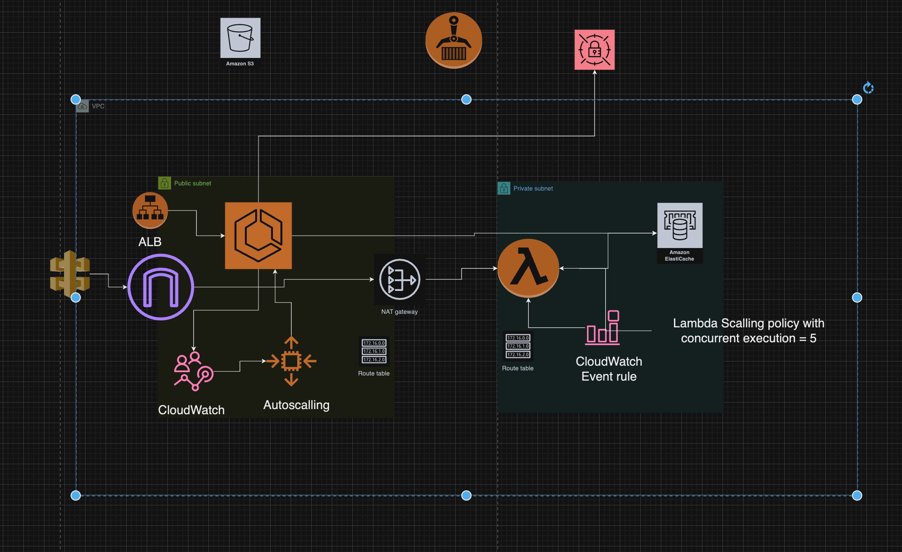

# Quotes Scraper Web App

This project is a **Go-based web application** designed to scrape quotes from the website [Quotes to Scrape](https://quotes.toscrape.com) and return them in JSON format via an HTTP endpoint. The app supports both local deployment and AWS Lambda deployment. It is built with Go v1.23 and leverages Docker for local development and Redis as the caching layer.

## Project Structure

- `.github/` - Contains GitHub Actions workflows for CI/CD.
- `config/` - Configuration files for the application.
  - `config.go` - Loads environment variables and provides application configuration. The `RUN_LOCAL_MODE` variable determines whether the app runs locally (`true`) or on AWS (`false`).
- `connection/` - Handles Redis connections and operations:
  - `elasticcache.go` - Initializes and interacts with Redis.
  - `quote.go` - Defines the `Quote` structure and handles Redis quote storage and retrieval.
- `ecs/` - Contains AWS ECS-related configurations.
- `infra/` - Infrastructure as code for deploying the application.
- `lambda/` - The AWS Lambda-specific implementation of the scraper.
- `scraper/` - Contains the main scraper logic for local deployment:
  - `scraper_main.go` - Implements the main logic for scraping quotes and storing them in Redis.
- `.env` - Environment variables for local development (not included in version control).
- `.env.example` - Example environment variables file.
- `.gitignore` - Specifies files and directories to be ignored by Git.
- `Docker-compose.yaml` - Docker Compose configuration for local deployment.
- `Dockerfile` - Builds the main application container.
- `Dockerfile.scraper` - Dockerfile specifically for the scraper service.
- `go.mod` and `go.sum` - Go dependencies and modules.
- `README.md` - Documentation file.

## Features

- Scrapes up to **100 quotes** from [Quotes to Scrape](https://quotes.toscrape.com), starting from the most recent.
- Returns scraped quotes in **JSON format** via an HTTP endpoint.
- Supports both **local and AWS Lambda deployments**.
- Stores quotes in Redis for caching and retrieval.
- Uses **operational memory** (Redis) for caching scraped quotes to enhance performance and reduce repeated HTTP requests.

## Environment Variables

The following environment variables must be configured in a `.env` file for the application to run:

```env
CACHE_PROVIDER=elasticache
RUN_LOCAL_MODE=true
ELASTICACHE_URL=redis:6379
SERVER_ADDRESS=:8080
BASE_URL=https://quotes.toscrape.com
DEFAULT_COUNT=100
```

### Variable Descriptions
- `CACHE_PROVIDER` - Specifies the cache provider (e.g., `elasticache`).
- `RUN_LOCAL_MODE` - Set to `true` for local deployment and `false` for AWS-based deployment.
- `ELASTICACHE_URL` - Redis connection URL (e.g., `redis:6379`).
- `SERVER_ADDRESS` - The address and port where the server will listen (default is `:8080`).
- `BASE_URL` - The base URL for scraping quotes.
- `DEFAULT_COUNT` - The default number of quotes to scrape.

## Local Deployment

### Steps to Run Locally

1. Copy `.env.example` to `.env` and modify the values as needed.
2. Build the Docker image:
   ```sh
   docker-compose build
   ```
3. Start the application:
   ```sh
   docker-compose up -d
   ```
4. Access the quotes API endpoint at:
   - Default: `http://localhost:8081/quotes`
   - With custom quote count: `http://localhost:8081/quotes?count=100` (replace `100` with the desired number of quotes, minimum value is `1`).

### Optional

You can modify the `count` parameter in the URL to specify how many quotes to retrieve.

## AWS Lambda Deployment

The `lambda/` folder contains the implementation for AWS Lambda deployment. It mirrors the functionality of the scraper but is optimized for Lambda.

- `main.go` - Entry point for the Lambda function.


## Key Files and Purpose

### Scraper Logic

- `scraper/scraper_main.go`: Implements the main scraper logic for local deployments.
  - Fetches quotes from the provided base URL.
  - Stores the quotes in Redis using the `connection` package.

### Redis Connection

- `connection/elasticcache.go`: Initializes the Redis client and provides methods to interact with Redis.
- `connection/quote.go`: Defines the `Quote` structure and provides helper methods for storing and retrieving quotes in Redis.

### Lambda

- `lambda/main.go`: Implements the scraping logic for AWS Lambda.
  - Initializes Redis.
  - Uses the same scraping logic as the local scraper but optimized for Lambda's event-driven model.

### Docker Files

- `Dockerfile`: Builds the main application image.
- `Dockerfile.scraper`: Builds a scraper-specific image.
- `Docker-compose.yaml`: Configures services for local development, including the scraper and Redis.


## Local Deployment

### Steps to Run Locally

1. Copy `.env.example` to `.env` and modify the values as needed.
2. Build the Docker image:
   ```sh
   docker-compose build
   ```
3. Start the application:
   ```sh
   docker-compose up -d
   ```
4. Access the quotes API endpoint at:
   - Default: `http://localhost:8081/quotes`
   - With custom quote count: `http://localhost:8081/quotes?count=100` (replace `100` with the desired number of quotes, minimum value is `1`).

### Optional

You can modify the `count` parameter in the URL to specify how many quotes to retrieve.

## AWS Lambda Deployment

The `lambda/` folder contains the implementation for AWS Lambda deployment. It mirrors the functionality of the scraper but is optimized for Lambda.

- `main.go` - Entry point for the Lambda function.

### Steps for AWS Lambda Deployment

1. Package the Lambda function.
2. Deploy it to AWS Lambda with appropriate environment variables.
3. Configure an API Gateway to expose the Lambda function's endpoint.

## Key Files and Purpose

### Scraper Logic

- `scraper/scraper_main.go`: Implements the main scraper logic for local deployments.
  - Fetches quotes from the provided base URL.
  - Stores the quotes in Redis using the `connection` package.

### Redis Connection

- `connection/elasticcache.go`: Initializes the Redis client and provides methods to interact with Redis.
- `connection/quote.go`: Defines the `Quote` structure and provides helper methods for storing and retrieving quotes in Redis.

### Lambda

- `lambda/main.go`: Implements the scraping logic for AWS Lambda.
  - Initializes Redis.
  - Uses the same scraping logic as the local scraper but optimized for Lambda's event-driven model.

### Docker Files

- `Dockerfile`: Builds the main application image.
- `Dockerfile.scraper`: Builds a scraper-specific image.
- `Docker-compose.yaml`: Configures services for local development, including the scraper and Redis.

## Usage

This application allows for easy scraping of quotes and provides flexible deployment options, making it suitable for various use cases such as collecting quotes for analysis or creating a quotes API.

## Running Locally

### Prerequisites

1. Ensure Docker is installed on your local machine.
2. Rename the `.env.example` file to `.env` and configure the required environment variables as needed.

### Steps to Run

1. Build the project:
   ```sh
   docker-compose build
   ```
2. Start the application:
   ```sh
   docker-compose up
   ```
   or for detached mode:
   ```sh
   docker-compose up -d
   ```
3. Open your browser and navigate to:
   - `http://localhost:8081/quotes?count=100`

   You can adjust the `count` parameter in the URL to retrieve a different number of quotes. For example, replace `100` with your desired number of quotes.

### Notes

- The application defaults to port `8081` for accessing the API. Ensure no other service is using this port.


## Infrastructure as Code (IaC)

### Terraform Overview

Terraform was chosen as the IaC tool for this project. The infrastructure is organized using the **root module** and **child modules** approach:

- **Child modules**: Stored in a separate GitHub repository. These encapsulate reusable components like VPC, security groups, and ECS configurations.
- **Root module**: Located in the `infra/tf-live/production` directory. It defines the overall structure and integrates the child modules for specific environments.

The naming convention of the `infra/tf-live/production` folder allows duplication of root modules for different environments (e.g., development, staging, production).

### Root Module Structure

- **`main.tf`**:
  ```hcl
  terraform {
    required_version = ">= 1.0.0"
    required_providers {
      aws = {
        source  = "hashicorp/aws"
        version = "~> 5.0"
      }
    }
  }

  module "vpc" {
    source               = "git::https://github.com/gortovenko/tf-modules.git//vpc"
    vpc_cidr             = var.vpc_cidr
    public_subnet_cidrs  = var.public_subnet_cidrs
    private_subnet_cidrs = var.private_subnet_cidrs
  }

  module "security_groups" {
    source         = "git::https://github.com/gortovenko/tf-modules.git//security_groups"
    vpc_id         = module.vpc.vpc_id
    redis_port     = 6379
    lambda_sg_name = "lambda_sg"
    redis_sg_name  = "redis_sg"
    ecs_sg_name    = "ecs_sg"
  }

  module "elasticache" {
    source         = "git::https://github.com/gortovenko/tf-modules.git//elasticache"
    engine_version = var.redis_engine_version
    cluster_id     = var.redis_cluster_id
    subnet_ids     = module.vpc.private_subnets
    sg_ids         = [module.security_groups.redis_sg_id]
  }

  module "iam" {
    source        = "git::https://github.com/gortovenko/tf-modules.git//iam"
    lambda_name   = var.lambda_function_name
    secrets_arn   = module.secrets_manager.secrets_arn
    ecs_task_role_name  = var.ecs_task_role_name
  }

  module "lambda" {
    source                 = "git::https://github.com/gortovenko/tf-modules.git//lambda"
    function_name          = var.lambda_function_name
    handler                = var.lambda_handler
    runtime                = var.lambda_runtime
    role_arn               = module.iam.lambda_role_arn
    vpc_subnet_ids         = module.vpc.private_subnets
    vpc_security_group_ids = [module.security_groups.lambda_sg_id]
    environment_variables  = {
      REDIS_ENDPOINT = module.elasticache.primary_endpoint_address
      REDIS_PORT     = tostring(module.elasticache.primary_endpoint_port)
      SECRETS_ARN    = module.secrets_manager.secrets_arn
    }
    source_path            = var.lambda_source_path

    depends_on = [module.secrets_manager]
  }

  module "api_gateway" {
    source        = "git::https://github.com/gortovenko/tf-modules.git//api_gateway"
    api_name      = var.api_name
    lambda_arn    = module.lambda.lambda_arn
    stage_name    = var.api_stage_name
  }

  module "ecs" {
  source                = "git::https://github.com/gortovenko/tf-modules.git//ecs"
  cluster_name          = var.ecs_cluster_name
  service_name          = var.ecs_service_name
  task_family           = var.ecs_task_family
  container_name        = var.ecs_container_name
  container_image       = var.ecs_container_image
  container_port        = var.ecs_container_port
  vpc_id                = module.vpc.vpc_id
  public_subnets        = module.vpc.public_subnet_ids
  ecs_security_group_id = module.security_groups.ecs_sg_id
  secrets_arn           = module.secrets_manager.secrets_arn


  depends_on = [module.secrets_manager]
}

module "ecr" {
  source          = "git::https://github.com/gortovenko/tf-modules.git//ecr"
  repository_name = var.repository_name
  environment     = var.environment
}


module "secrets_manager" {
  source          = "git::https://github.com/gortovenko/tf-modules.git//secrets_manager"
  secrets_name    = var.secrets_name
  cache_provider  = var.cache_provider
  run_local_mode  = var.run_local_mode
  elasticache_url = module.elasticache.primary_endpoint_address
  server_address  = var.server_address
  base_url        = var.base_url
  default_count   = var.default_count
  environment     = var.environment
}

module "s3" {
  source         = "git::https://github.com/gortovenko/tf-modules.git//s3"
  bucket_name    = var.bucket_name
  s3_bucket_name = var.s3_bucket_name
  environment    = var.environment

}
  ```

- **`backend.tf`**:
  Configures the Terraform backend to store the state file in an S3 bucket with DynamoDB table locking.
  ```hcl
  terraform {
    backend "s3" {
      bucket         = "quote-my"
      key            = "infra/tf-live/production-github/terraform.tfstate"
      region         = "us-east-1"
      encrypt        = true
      dynamodb_table = "quote"
      acl            = "private"
    }
  }
  ```

### Backend Details

- **S3 bucket**:
  - Used for storing the Terraform state file.
  - Bucket access is private, and versioning is enabled to maintain state history.
  - Regular backups are recommended.

- **DynamoDB table**:
  - Used for state locking to prevent concurrent modifications.
  - Encryption is enabled for enhanced security.

### Infrastructure Diagram





#### Services and Purpose

1. **Amazon VPC**: Provides an isolated network environment for resources.
   - Includes public and private subnets for different types of workloads.
   - Internet Gateway allows public access for ALB and ECS services.

2. **Elastic Load Balancer (ALB)**: Distributes incoming traffic across ECS tasks for high availability.

3. **Amazon ECS (Fargate)**: Runs containerized services. Each service is associated with a specific task definition and communicates with ALB and other resources securely.

4. **AWS Lambda**: Executes the scraper logic. Configured with a scaling policy to allow a maximum of 5 concurrent executions.

5. **Amazon ElastiCache (Redis)**: Provides a caching layer for storing and retrieving scraped quotes efficiently.

6. **Amazon CloudWatch**:
   - Monitors ECS and Lambda performance metrics.
   - Triggers AWS Lambda functions periodically using event rules.

7. **AWS Secrets Manager**: Manages sensitive configuration like database credentials and API keys securely.

8. **S3 Bucket**: Stores Terraform state files for infrastructure management.

9. **DynamoDB**: Ensures state file locking to prevent concurrent Terraform execution.

10. **API Gateway**: Exposes a REST API endpoint to invoke Lambda functions for scraping quotes.

11. **Autoscaling Policies**:
    - **ECS Autoscaling**:
      - Target tracking policy adjusts the number of ECS tasks based on average CPU or memory utilization thresholds (e.g., CPU > 70%).
      - Ensures that services can handle varying loads efficiently without over-provisioning.
    - **Lambda Autoscaling**:
      - Configured with reserved concurrency limits to prevent overloading downstream systems.
      - Scales dynamically based on the number of event triggers while maintaining a maximum of 5 concurrent executions.


# CI/CD Workflow Documentation

## Overview

This document outlines the CI/CD pipeline implemented for deploying infrastructure and applications to AWS. The pipeline leverages **GitHub Actions** for orchestration and **Terraform** for infrastructure provisioning. It includes robust automation, testing, and rollback mechanisms to ensure a seamless deployment experience.

---

## Workflow Triggering

The pipeline triggers based on the following events:

1. **Push to the `main` branch**: Any code changes pushed to the `main` branch automatically initiate the workflow.
2. **Manual Dispatch**: Allows manual triggering of the workflow via the `workflow_dispatch` event in GitHub Actions.

---

## Pipeline Stages and Steps

### 1. **Deploy Infrastructure**

**Description:** This stage provisions the AWS infrastructure required for the application.

#### Steps:

1. **Checkout Code**
   - Pulls the latest code from the repository.
   ```yaml
   - name: Checkout Code
     uses: actions/checkout@v3
   ```

2. **Configure AWS Credentials**
   - Authenticates securely with AWS using credentials stored in GitHub Secrets.
   ```yaml
   - name: Configure AWS Credentials
     uses: aws-actions/configure-aws-credentials@v2
     with:
       aws-access-key-id: ${{ secrets.AWS_ACCESS_KEY_ID }}
       aws-secret-access-key: ${{ secrets.AWS_SECRET_ACCESS_KEY }}
       aws-region: ${{ secrets.AWS_REGION }}
   ```

3. **Generate Terraform Configuration Files**
   - Dynamically creates `terraform.tfvars` and `prod.tfvars` files using environment variables.
   ```yaml
   - name: Generate terraform.tfvars Securely
     run: |
       cat <<EOF > infra/tf-live/production/terraform.tfvars
       region = "${{ secrets.REGION }}"
       ecs_cluster_name = "${{ secrets.ECS_CLUSTER_NAME }}"
       ...
       EOF
   ```

4. **Initialize and Validate Terraform**
   - Initializes Terraform and validates the configuration for syntax and correctness.
   ```yaml
   - name: Initialize Terraform
     working-directory: infra/tf-live/production
     run: terraform init

   - name: Validate Terraform
     working-directory: infra/tf-live/production
     run: terraform validate
   ```

5. **Plan Terraform Changes**
   - Generates an execution plan without making changes.
   ```yaml
   - name: Plan Terraform Changes
     working-directory: infra/tf-live/production
     env:
       AWS_ACCESS_KEY_ID: ${{ secrets.AWS_ACCESS_KEY_ID }}
       AWS_SECRET_ACCESS_KEY: ${{ secrets.AWS_SECRET_ACCESS_KEY }}
     run: |
       terraform plan \
       -var-file="terraform.tfvars" \
       -var-file="prod.tfvars"
   ```

6. **Apply Targeted Terraform Changes**
   - Provisions resources such as ECR, S3, Secrets Manager, and VPC in parallel.
   ```yaml
   - name: Apply Terraform Changes for ECR Module
     working-directory: infra/tf-live/production
     env:
       AWS_ACCESS_KEY_ID: ${{ secrets.AWS_ACCESS_KEY_ID }}
       AWS_SECRET_ACCESS_KEY: ${{ secrets.AWS_SECRET_ACCESS_KEY }}
     run: |
       terraform apply \
       -target=module.ecr \
       -target=module.secrets_manager \
       -target=module.s3 \
       -target=module.vpc \
       -var-file="terraform.tfvars" \
       -var-file="prod.tfvars" \
       -parallelism=10 \
       -auto-approve
   ```

---

### 2. **Deploy Applications**

**Description:** This stage deploys the application to ECS and Lambda.

#### Steps:

1. **Build and Package Application**
   - Builds the Go binary for Lambda and compresses it into a `.zip` file.
   ```yaml
   - name: Package Lambda Function
     run: |
       cd lambda
       GOOS=linux GOARCH=amd64 CGO_ENABLED=0 go build -o main main.go
       zip -j function.zip main
       cd ..
   ```

2. **Build and Push Docker Image**
   - Builds the Docker image for the scraper service and pushes it to ECR.
   ```yaml
   - name: Build and Push Docker Image
     run: |
       docker build -t ${{ secrets.REPOSITORY_NAME }} -f Dockerfile.scraper .
       docker tag ${{ secrets.REPOSITORY_NAME }}:latest ${{ secrets.AWS_ACCOUNT_ID }}.dkr.ecr.${{ secrets.REGION }}.amazonaws.com/${{ secrets.REPOSITORY_NAME }}:latest
       docker push ${{ secrets.AWS_ACCOUNT_ID }}.dkr.ecr.${{ secrets.REGION }}.amazonaws.com/${{ secrets.REPOSITORY_NAME }}:latest
   ```

3. **Deploy ECS Service**
   - Updates the ECS service with the latest Docker image.
   ```yaml
   - name: Update ECS Service
     run: |
       aws ecs update-service --cluster ${{ secrets.ECS_CLUSTER_NAME }} --service ${{ secrets.ECS_SERVICE_NAME }} --force-new-deployment --region ${{ secrets.REGION }}
   ```

4. **Deploy Lambda Function**
   - Updates the Lambda function with the newly built `.zip` file.
   ```yaml
   - name: Deploy Lambda Function
     run: |
       aws lambda update-function-code \
         --function-name ${{ secrets.LAMBDA_FUNCTION_NAME }} \
         --zip-file fileb://function.zip \
         --region ${{ secrets.REGION }}
   ```

---

### 3. **Verify Deployment**

**Description:** Validates the deployment by checking ECS and Lambda health and testing API endpoints.

#### Steps:

1. **Verify ECS Cluster and Lambda Function**
   - Ensures the ECS cluster and Lambda function are healthy and operational.
   ```yaml
   - name: Verify ECS Cluster
     run: |
       aws ecs describe-clusters --clusters ${{ secrets.ECS_CLUSTER_NAME }} --region ${{ secrets.REGION }}

   - name: Verify Lambda Function
     run: |
       aws lambda get-function --function-name ${{ secrets.LAMBDA_FUNCTION_NAME }} --region ${{ secrets.REGION }}
   ```

2. **Test API Endpoint and Lambda**
   - Sends requests to the API endpoint and invokes the Lambda function to verify functionality.
   ```yaml
   - name: Test API Endpoint
     run: |
       RESPONSE=$(curl -s -o /dev/null -w "%{http_code}" ${{ secrets.TEST_ENDPOINT }})
       if [ $RESPONSE -ne 200 ]; then
         echo "API test failed with response code $RESPONSE"
         exit 1
       else
         echo "API test passed with response code $RESPONSE"
       fi
   ```

---

### 4. **Rollback Infrastructure**

**Description:** Reverts ECS and Lambda to their previous stable versions in case of failure.

#### Steps:

1. **Rollback ECS**
   - Updates the ECS service to use the previous task definition.
   ```yaml
   - name: Rollback ECS to Previous Container Version
     run: |
       if [ -z "${{ secrets.PREVIOUS_TASK_DEFINITION }}" ]; then
         echo "Previous task definition not defined. Rollback aborted."
         exit 1
       else
         aws ecs update-service \
           --cluster ${{ secrets.ECS_CLUSTER_NAME }} \
           --service ${{ secrets.ECS_SERVICE_NAME }} \
           --force-new-deployment \
           --region ${{ secrets.AWS_REGION }} \
           --task-definition ${{ secrets.PREVIOUS_TASK_DEFINITION }}
         echo "ECS service rolled back to previous task definition: ${{ secrets.PREVIOUS_TASK_DEFINITION }}"
       fi
   ```

2. **Rollback Lambda**
   - Reverts the Lambda function to the latest stable version.
   ```yaml
   - name: Rollback Lambda to Stable Version
     run: |
       STABLE_VERSION=$(aws lambda list-versions-by-function \
         --function-name ${{ secrets.LAMBDA_FUNCTION_NAME }} \
         --region ${{ secrets.AWS_REGION }} \
         --query "Versions[?Description=='stable'].Version" \
         --output text)

       if [ -z "$STABLE_VERSION" ]; then
         echo "No stable version available for rollback"
         exit 1
       else
         aws lambda update-alias \
           --function-name ${{ secrets.LAMBDA_FUNCTION_NAME }} \
           --name stable \
           --function-version $STABLE_VERSION \
           --region ${{ secrets.AWS_REGION }}
         echo "Lambda function has been rolled back to version $STABLE_VERSION"
       fi
   ```

---

## Summary

This CI/CD pipeline ensures secure, automated deployment and management of infrastructure and applications. It provides verification, testing, and rollback mechanisms to maintain system stability and reliability.

